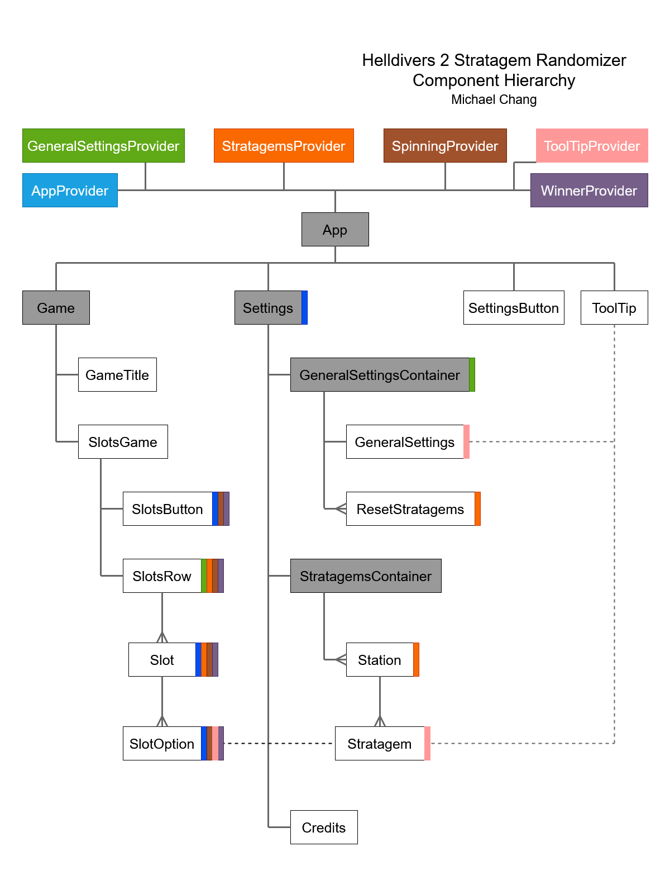

# [Helldivers 2 Stratagem Randomizer](http://helldivers-randomizer.surge.sh/)

The Helldivers 2 Stratagem Randomizer is a React based web application that randomly selects 4 stratagems for use in the video game Helldivers 2 and can be accessed [here](http://helldivers-randomizer.surge.sh/). It is meant for the gamers who are looking for a challenge or to spice things up during their spread of democracy. It is highly recommended to use the randomizer with friends to maximize the rate of success. 

The application features a slots-like randomization design, a configurable stratagem pool, logic to prevent duplicate stratagem selection, and toggle-able common sense logic that makes the randomizer slightly more forgiving. The common sense logic feature prevents the selection of stratagems that double up on backpack slots, double up on support weapons, and will ensure at least 1 stratagem that has the capability to kill a bile titan. 

## React Component Hierarchy

## Acknowledgements

This project is fan-made and is not affiliated with Helldivers, Arrowhead Studios, or Playstation Studios.

All stratagem icons are from the [Helldivers-2-Stratagems-icons-svg](https://github.com/nvigneux/Helldivers-2-Stratagems-icons-svg/tree/master) repository, credited to [nvigneux](https://github.com/nvigneux) and [ndorfin](https://github.com/ndorfin).

All other svg art (non-stratagem) art is created by me with Inkscape and a steady hand.
